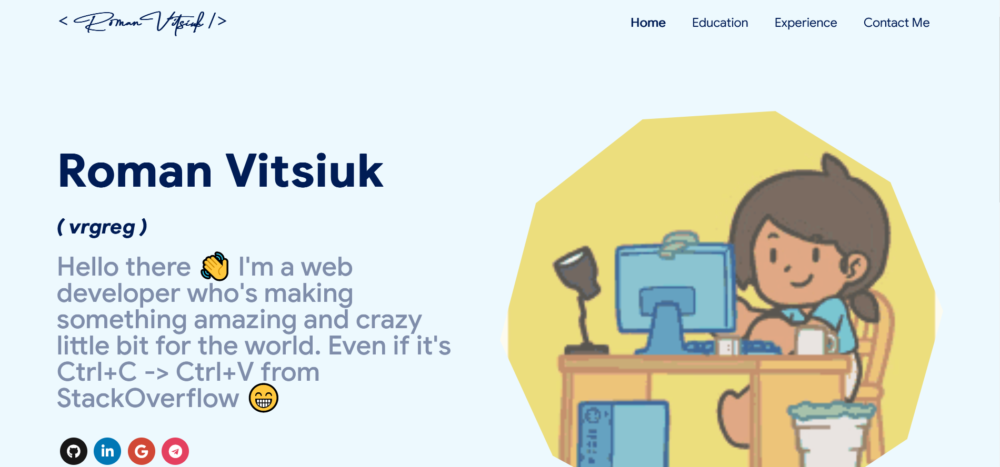

<h1 align="center"><a href="https://lancergreg.github.io/portfolio">VRGreg's portfolio</a></h1>

 
  

<h2>Pages 📄</h2>

  <a href="https://lancergreg.github.io/portfolio/#/home">➡️ Summary and About me</a> 
  <a href="https://lancergreg.github.io/portfolio/#/education">➡️ Education</a> 
  <a href="https://lancergreg.github.io/portfolio/#/experience">➡️ Experience</a> 
  <a href="https://lancergreg.github.io/portfolio/#/contact">➡️ Contact me</a>

<h2>Clone portfolio</h2>

This portfolio was built by a portfolio temp -> <a href="https://github.com/ashutosh1919/masterPortfolio">MasterPortfolio

